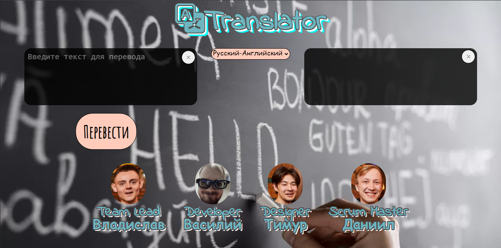

<p align="center">

</p>


</div>
<h1 align="center">Переводчик</h1>

<p align="center">


 
 
</p>

<h1 align="center">Описание</h1>

Перед вами открывается групповой проект одной амбициозной команды "4 бочки", которые реализовали сайт-переводчик, в основе которого лежит машинное обучение. 

## Помощь в работе

Для перевода текста есть слева поле для ввода. Справа поле для вывода переведенного текста. Для работы приложения необходимо лишь иметь доступ к интернету. функционал до тривиального прост, жмете кнопку "Перевести", ваш текст переводится, жмете на "крестик" в укзанной области, удаляется текст в зависимости от области



Также рядом с этим полем есть всплывающее меню с выбором языка, в котором пока доступно только два пункта


## Использованные инструменты

- Фронт и бэк : Flask, css, html
- Ml инструменты : torch, готовая модель для перевода текста от автора: ["cointegrated"](https://habr.com/ru/users/cointegrated/)
- Дизайн: подбор сочетаний цветов на сайтах, выбор картинки из интернета и собственное мнение

 
  
## Как установить

```
pip install flask
pip install torch
pip install transformers
```

## Планы на будущее

- Увеличение списка выбора языка
- Загрузка приложения на сервер
- Перевод документов
- Добавление всей контактной информации на главной странице


